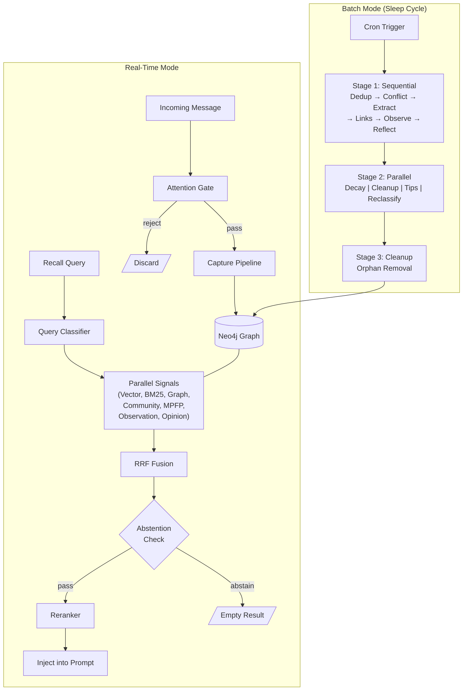
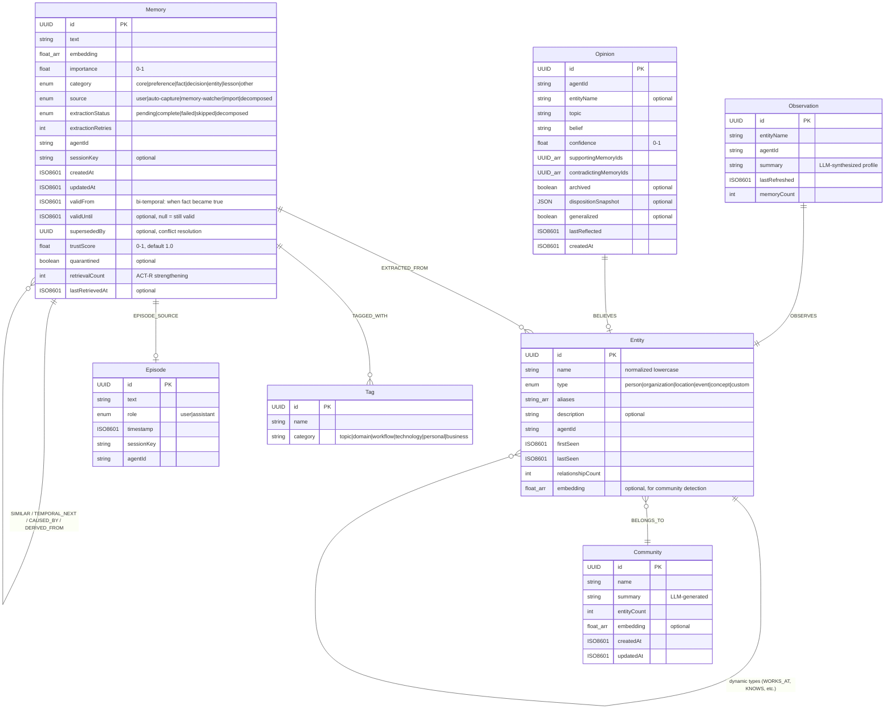
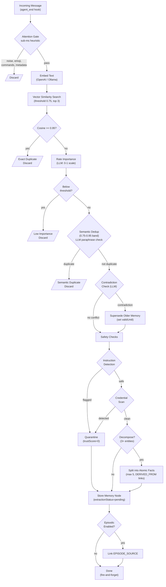
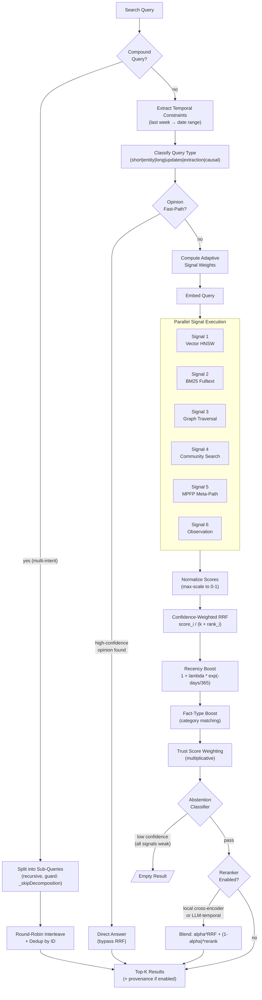
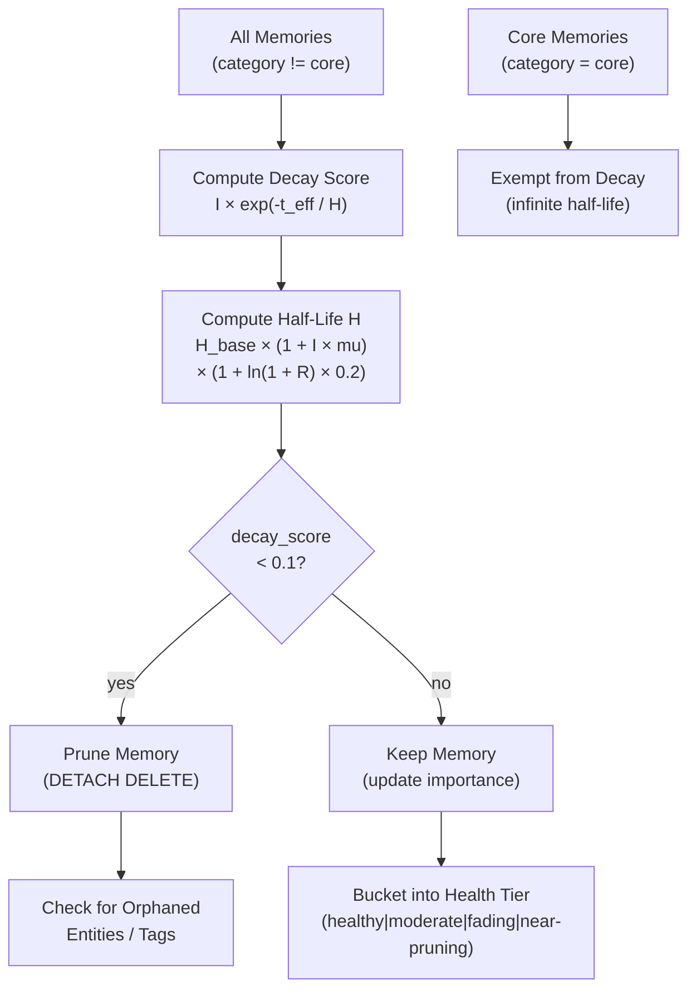
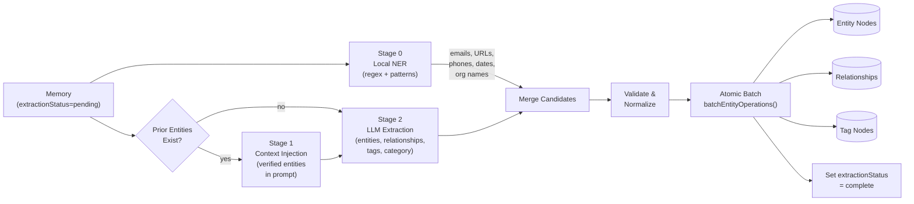
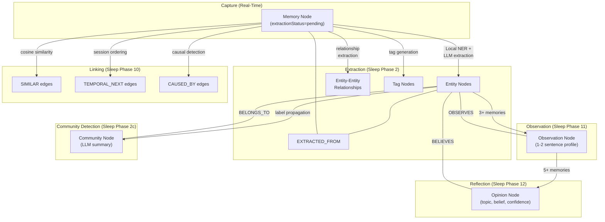
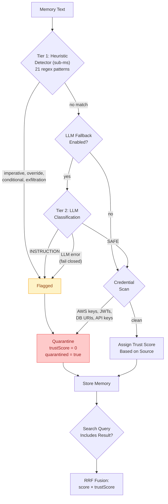

# Memory Neo4j: A Graph-Native Agentic Memory System with Multi-Signal Hybrid Retrieval and Cognitive Consolidation

## Abstract

We describe the architecture of memory-neo4j, a long-term persistent memory system for conversational AI agents built on the Neo4j graph database. The system addresses the core challenge of agentic memory: how to capture, organize, retrieve, and maintain a growing body of facts, relationships, and beliefs accumulated over thousands of conversations.

The architecture combines three foundational ideas. First, a **seven-signal hybrid retrieval** pipeline fuses vector similarity, BM25 keyword matching, graph traversal, community search, meta-path forward push, entity observations, and opinion-based direct answers via confidence-weighted Reciprocal Rank Fusion (RRF) with query-adaptive signal weights. Second, a **multi-phase sleep cycle** performs offline consolidation — deduplication, entity extraction, link creation, observation synthesis, opinion formation, decay, and cleanup — modeled after biological memory consolidation during sleep. Third, a **temporal knowledge graph** with bi-temporal validity, trust scoring, and memory decay based on the Ebbinghaus forgetting curve and ACT-R retrieval strengthening provides the underlying data model.

The system is implemented as a bundled plugin for the OpenClaw agent platform, comprising approximately 44,000 lines of TypeScript across 70+ modules with a dedicated evaluation framework.

## Table of Contents

1. [Introduction](#1-introduction)
2. [Related Work](#2-related-work)
3. [System Overview](#3-system-overview)
4. [Data Model](#4-data-model)
5. [Memory Capture Pipeline](#5-memory-capture-pipeline)
6. [Hybrid Retrieval System](#6-hybrid-retrieval-system)
7. [Sleep Cycle Consolidation](#7-sleep-cycle-consolidation)
8. [Memory Decay and Forgetting](#8-memory-decay-and-forgetting)
9. [Knowledge Graph Construction](#9-knowledge-graph-construction)
10. [Safety and Trust](#10-safety-and-trust)
11. [Configuration and Extensibility](#11-configuration-and-extensibility)
12. [Evaluation Framework](#12-evaluation-framework)
13. [Module Reference](#13-module-reference)
14. [References](#14-references)

---

## 1. Introduction

Large language model agents engaged in persistent, multi-session interaction face a fundamental limitation: the context window is finite and ephemeral. Without an external memory system, an agent cannot learn from past interactions, accumulate knowledge about users and domains, or develop coherent long-term behavior.

Existing approaches to agentic memory fall broadly into three categories: (a) vector-store retrieval augmented generation (RAG), which treats memory as a flat collection of embeddings; (b) agent-managed memory, where the LLM itself decides what to store via tool calls; and (c) structured knowledge graphs, which capture entities and relationships but require careful maintenance.

memory-neo4j integrates all three approaches into a unified system. Vector embeddings provide semantic retrieval. Graph structure captures entities, relationships, communities, and causal chains. LLM-based extraction and consolidation processes maintain the knowledge graph automatically. The agent retains explicit control through dedicated memory tools while benefiting from automatic capture and recall hooks.

The design is guided by several principles:

- **Multi-signal retrieval.** No single retrieval signal is sufficient for all query types. Short keyword queries need BM25 precision; conceptual questions need vector semantics; relational questions need graph traversal. The system runs all signals in parallel and fuses them adaptively.

- **Offline consolidation.** Expensive operations — entity extraction, deduplication, conflict resolution, opinion synthesis — run offline during a scheduled "sleep cycle" rather than blocking real-time conversation.

- **Cognitive plausibility.** Memory decay follows the Ebbinghaus forgetting curve. Retrieval strengthens memories per the ACT-R model. The tiered architecture — episodic, semantic, and reflective memory — mirrors cognitive science models of human memory.

- **Graceful degradation.** Every signal, every phase, and every external dependency has a fallback path. If Neo4j is unreachable, tools return graceful errors. If the LLM extraction fails, memories are stored with `extractionStatus=pending` for later processing.

- **Safety by default.** Instruction injection detection, credential scanning, memory quarantine, and trust scoring operate at both capture time and during sleep consolidation.

## 2. Related Work

### 2.1 Vector-Based Memory Systems

Mem0 [1] provides a dual-persistence architecture writing to both vector stores and graph databases simultaneously. Every `memory.add()` call triggers LLM extraction of entities and relationships. Retrieval runs vector similarity and graph traversal in parallel. Mem0 achieves a 26% accuracy improvement over OpenAI Memory on the LOCOMO benchmark, with 91% lower p95 latency versus full-context approaches.

LangGraph/LangMem [2] takes a framework approach, providing building blocks (checkpointers for short-term, stores for long-term) rather than an opinionated memory service. Memory can be extracted via a hot path (real-time) or background path (asynchronous). The system lacks built-in graph traversal.

### 2.2 Temporal Knowledge Graphs

Zep/Graphiti [3] is the most graph-native system in the comparison space. It organizes memory into a three-tier hierarchical knowledge graph: Episodes (raw data), Semantic Entities (extracted entities with relationships), and Communities (clustered entity summaries). Its distinguishing feature is a bi-temporal model with four timestamps per edge (`created`, `expired`, `valid_from`, `invalid_from`), enabling precise point-in-time queries. Graphiti achieves 94.8% on the DMR benchmark.

Neo4j Agent Memory [4] from Neo4j Labs provides a graph-native memory with a POLE+O data model (Person, Object, Location, Event, Organization). It supports vector search, graph traversal, and metadata filtering but requires explicit API calls for memory creation — there is no automatic extraction.

### 2.3 Agent-Managed Memory

Letta (formerly MemGPT) [5] treats memory management as an operating system problem. The LLM manages its own memory using tools: `core_memory_append`, `core_memory_replace`, `archival_memory_insert`, and `archival_memory_search`. Core memory is always present in the context window; archival memory is vector-searchable. The agent decides what to store — there is no automatic extraction. Letta achieves 93.4% on the DMR benchmark.

### 2.4 Hybrid Knowledge Graphs

Cognee [6] combines a graph store, vector store, and relational store into a unified pipeline. Its `cognify` stage extracts entities and relationships; its `memify` stage refines the graph over time by pruning stale nodes and strengthening frequent connections. Cognee supports 14 retrieval modes.

### 2.5 Cognitive Science Foundations

The memory decay model draws on the **Ebbinghaus forgetting curve** [7], which models retention as an exponential function of time. The **ACT-R** (Adaptive Control of Thought—Rational) model [8] provides the retrieval-based strengthening mechanism: memories that are accessed more frequently decay more slowly. The tiered memory architecture (episodic, semantic, reflective) follows the classification established by Tulving [9]. The sleep consolidation metaphor reflects research on memory consolidation during sleep [10].

The opinion/belief synthesis system is inspired by **CARA** (Cognitive Architecture for Reflective Agents) [11], which models opinion formation from accumulated evidence with Bayesian confidence updating.

### 2.6 Information Retrieval

Reciprocal Rank Fusion (RRF) was introduced by Cormack et al. [12] as a method for combining multiple ranked lists. The standard formula assigns a score of `1/(k + rank)` for each list. We extend this with **confidence weighting**, where the original score is preserved as a multiplicative factor: `score_i / (k + rank_i)`. This prevents a high-ranked but low-confidence result from dominating fusion.

The Meta-Path Forward Push (MPFP) traversal is adapted from the Hindsight system [13], which uses typed edge sequences to explore knowledge graphs with controlled fan-out and probability mass decay.

## 3. System Overview

### 3.1 Architecture

The system operates in two modes:

**Real-time mode** handles message capture and memory recall during conversation. The capture path filters, rates, deduplicates, and stores memories asynchronously. The recall path runs seven-signal hybrid search and injects relevant memories into the agent's prompt. Both paths are latency-sensitive and use fire-and-forget patterns with graceful degradation.

**Batch mode** runs the sleep cycle on a configurable cron schedule (typically nightly). The sleep cycle performs 18 phases of consolidation: deduplication, entity extraction, link creation, observation synthesis, opinion formation, decay, and cleanup. These operations are LLM-intensive and too expensive for real-time execution.



### 3.2 Integration

memory-neo4j integrates with the OpenClaw agent platform via four mechanisms:

1. **Plugin hooks** — `before_prompt_build` (auto-recall), `agent_end` (auto-capture), `session_end` (cleanup), `agent_bootstrap` (core memory injection)
2. **Memory tools** — `memory_recall`, `memory_store`, `memory_forget` exposed to the agent's tool set
3. **CLI commands** — `openclaw memory neo4j {list, search, sleep, stats, eval, forget}`
4. **Service lifecycle** — `start()` initializes Neo4j connection, indexes, warm-up; `stop()` drains in-flight captures, flushes buffers, closes driver

### 3.3 Module Organization

The codebase follows a delegation pattern. `Neo4jMemoryClient` is a thin facade that delegates to specialist modules, each owning a single concern:

| Layer          | Modules                                                                               | Responsibility                                                   |
| -------------- | ------------------------------------------------------------------------------------- | ---------------------------------------------------------------- |
| Client facade  | `neo4j-client.ts`                                                                     | Connection management, driver lifecycle, delegation              |
| Storage        | `neo4j-client-memory.ts`, `neo4j-client-entity.ts`, `neo4j-client-episode.ts`         | CRUD for Memory, Entity, Tag, Episode nodes                      |
| Search         | `neo4j-client-search.ts`, `search.ts`, `mpfp-search.ts`                               | Raw signals, hybrid fusion, meta-path traversal                  |
| Knowledge      | `neo4j-client-observation.ts`, `neo4j-client-opinion.ts`, `neo4j-client-community.ts` | Observation, Opinion, Community node management                  |
| Sleep          | `sleep-cycle.ts`, `sleep-phases-*.ts`                                                 | Consolidation phase orchestration and execution                  |
| Extraction     | `extractor.ts`, `extractor-*.ts`                                                      | Entity/relationship extraction, importance rating, dedup         |
| Safety         | `instruction-detector.ts`, `attention-gate.ts`                                        | Injection detection, noise filtering, credential scanning        |
| Infrastructure | `embeddings.ts`, `llm-client.ts`, `retry.ts`, `errors.ts`, `metrics.ts`               | Provider abstraction, retry, error classification, observability |

## 4. Data Model

### 4.1 Node Types

The knowledge graph comprises seven node types, shown in the entity-relationship diagram below:



### 4.2 Relationship Types

| Relationship     | Source → Target      | Properties                                   | Purpose                                      |
| ---------------- | -------------------- | -------------------------------------------- | -------------------------------------------- |
| `EXTRACTED_FROM` | Memory → Entity      | —                                            | Extraction provenance                        |
| `TAGGED_WITH`    | Memory → Tag         | —                                            | Category tagging                             |
| `SIMILAR`        | Memory → Memory      | weight: float, createdAt                     | Cosine similarity edges (Phase 10)           |
| `TEMPORAL_NEXT`  | Memory → Memory      | —                                            | Chronological ordering within agent          |
| `CAUSED_BY`      | Memory → Memory      | —                                            | Causal chain links                           |
| `DERIVED_FROM`   | Memory → Memory      | —                                            | Decomposition lineage                        |
| `EPISODE_SOURCE` | Memory → Episode     | —                                            | Episodic memory linking                      |
| `BELONGS_TO`     | Entity → Community   | —                                            | Community membership                         |
| `OBSERVES`       | Observation → Entity | —                                            | Observation target                           |
| `BELIEVES`       | Opinion → Entity     | —                                            | Entity-specific belief                       |
| Dynamic types    | Entity → Entity      | confidence, validFrom, validUntil, qualifier | Domain relationships (WORKS_AT, KNOWS, etc.) |

Entity-to-entity relationships use dynamic `UPPER_SNAKE_CASE` type names generated during extraction. Each carries temporal properties (`validFrom`, `validUntil`) and a confidence score, enabling the bi-temporal model described in Section 4.3.

### 4.3 Bi-Temporal Validity Model

Every Memory node maintains two temporal dimensions following the approach established by Graphiti [3]:

- **Valid time** (`validFrom`, `validUntil`): when the fact was true in the real world. `validFrom` defaults to `createdAt`; `validUntil` is null for active facts.
- **Transaction time** (`createdAt`, `updatedAt`): when the record was created/modified in the system.

Search queries apply temporal filtering by default:

```cypher
WHERE m.validUntil IS NULL                                    -- Active-only (default)
WHERE m.validFrom <= $asOf AND (m.validUntil IS NULL          -- Point-in-time query
      OR m.validUntil > $asOf)
```

When a contradiction is detected (Section 7.3), the older memory's `validUntil` is set to the current timestamp and `supersededBy` points to the replacement memory. This preserves the historical record while preventing outdated facts from appearing in search results.

### 4.4 Indexes

| Type                  | Name                       | Target                                                 | Purpose                                   |
| --------------------- | -------------------------- | ------------------------------------------------------ | ----------------------------------------- |
| HNSW vector           | `memory_embedding_index`   | Memory.embedding                                       | Cosine similarity search                  |
| HNSW vector           | `entity_embedding_index`   | Entity.embedding                                       | Entity similarity for community detection |
| Fulltext (BM25)       | `memory_fulltext_index`    | Memory.text                                            | Keyword search with Lucene                |
| Fulltext (BM25)       | `entity_fulltext_index`    | Entity.name, Entity.description                        | Entity name lookup                        |
| Fulltext (BM25)       | `community_fulltext_index` | Community.name, Community.summary                      | Community search                          |
| Composite property    | `observation_agent_entity` | Observation.agentId, Observation.entityName            | Observation lookup                        |
| Composite property    | `opinion_agent_topic`      | Opinion.agentId, Opinion.topic                         | Opinion lookup                            |
| Uniqueness constraint | —                          | Memory.id, Entity.id, Tag.id, Episode.id, Community.id | Primary key enforcement                   |

## 5. Memory Capture Pipeline

### 5.1 Overview

The capture pipeline processes incoming messages through a series of gates before storage. It operates in fire-and-forget mode from the `agent_end` hook — the agent does not wait for storage to complete. In-flight capture promises are tracked in an `outstandingCaptures` set and drained during graceful shutdown.



### 5.2 Attention Gate

The attention gate (`attention-gate.ts`) applies lightweight heuristic filtering to reject noise before any embedding or LLM call. The gate operates in sub-millisecond time and filters:

| Category              | Examples                                                     | Threshold     |
| --------------------- | ------------------------------------------------------------ | ------------- |
| Length                | Too short (< 30 chars) or too long (> 2000 chars, truncated) | Hard limits   |
| Word count            | Fewer than 8 words                                           | Reject        |
| Conversational noise  | "ok", "thanks", "sounds good", "yep"                         | Pattern match |
| Structural noise      | Pure XML/JSON, empty, < 3 chars                              | Pattern match |
| Emoji-heavy           | Messages with > 3 emoji and little text                      | Ratio check   |
| Imperative commands   | "let's install X", "run the migration"                       | Pattern match |
| Channel metadata      | Slack IDs, envelope keys, sender metadata                    | Pattern match |
| System infrastructure | Heartbeats, cron tasks, gateway restarts                     | Pattern match |
| Injected context      | `<relevant-memories>`, `<core-memory-refresh>` tags          | Pattern match |

### 5.3 Importance Rating

Messages that pass the attention gate are rated for importance via an LLM call. The prompt evaluates actionability, specificity, and novelty on a 0–1 scale. When extraction is disabled, a fixed 0.5 fallback is used to avoid blocking all captures. Memories below a configurable importance threshold are discarded.

### 5.4 Deduplication

Deduplication operates in two tiers using a single vector similarity query:

1. **Exact deduplication** (cosine ≥ 0.95): The memory is an exact or near-exact duplicate. It is silently discarded.
2. **Semantic deduplication** (cosine 0.75–0.95): The memory might be a paraphrase. An LLM confirms or rejects the duplicate classification.

### 5.5 Inline Contradiction Detection

For candidates in the 0.75–0.95 similarity band that are not duplicates, the system checks for contradiction. An LLM evaluates whether the new memory contradicts an existing one. If so, the older memory is superseded: its `validUntil` is set to the current time and `supersededBy` points to the new memory's ID.

### 5.6 Safety Checks

Two safety mechanisms operate at capture time:

- **Instruction detection** (Section 10.1): Detects prompt injection patterns. Flagged memories are stored with `quarantined=true` and `trustScore=0`.
- **Credential scanning** (Section 10.2): Detects API keys, tokens, database URIs. Flagged memories are quarantined.

### 5.7 Decomposition

Optionally, memories containing three or more entities are decomposed into atomic single-entity facts. Each derived fact is linked to the original via a `DERIVED_FROM` relationship. Decomposition improves vector search precision by eliminating multi-topic conflation. A maximum of 5 atomic facts per memory caps LLM cost.

### 5.8 Storage

The final memory is stored with `MERGE` semantics (idempotent on `id`). If extraction is enabled, `extractionStatus` is set to `pending` for later processing by the sleep cycle. If episodic memory is enabled, an `EPISODE_SOURCE` relationship links the memory to its source Episode node.

## 6. Hybrid Retrieval System

### 6.1 Design Rationale

No single retrieval signal is sufficient for the diversity of queries an agent encounters. Short keyword queries ("John's phone number") need exact matching. Conceptual queries ("what do I know about project planning?") need semantic similarity. Relational queries ("who works with Sarah?") need graph traversal. Temporal queries ("what changed last week?") need recency awareness.

The hybrid retrieval system addresses this by running multiple signals in parallel and fusing them via an adaptive variant of Reciprocal Rank Fusion.



### 6.2 Signal Descriptions

**Signal 1: Vector Similarity (HNSW Cosine).** The query is embedded using the configured embedding provider (OpenAI or Ollama) and searched against the `memory_embedding_index` via Neo4j's native HNSW implementation. Results are filtered by agent scope, temporal validity, quarantine status, and optional date range constraints. Scores are in [0, 1].

**Signal 2: BM25 Full-Text.** The query is searched against the `memory_fulltext_index` using Lucene's BM25 scoring. For extraction-type queries, morphological expansion is applied via Porter stemming: "preferred meetings" becomes `(preferred OR prefer OR prefers) (meetings OR meeting)`. Raw BM25 scores are unbounded; they are max-normalized to [0, 1] with a floor of 0.3 to prevent a single weak match from inflating its RRF contribution.

**Signal 3: Graph Traversal (Spreading Activation).** Entity names are extracted from the query via fulltext lookup on the entity index. From seed entities, the system performs N-hop spreading activation (configurable 1–3 hops) through entity-to-entity relationships, collecting connected Memory nodes via reverse `EXTRACTED_FROM` edges. Confidence decays by 0.3 per hop. A 1-second timeout prevents runaway traversals.

**Signal 4: Community Search.** Community nodes are queried via fulltext, then expanded to member entities and their connected memories. This signal captures cluster-level topic relevance that individual entity lookup might miss.

**Signal 5: MPFP Meta-Path Forward Push.** Adapted from the Hindsight system [13], MPFP traverses the graph along typed edge sequences (meta-paths) from seed memories identified by Signals 1 and 2. Each meta-path encodes a reasoning strategy:

| Pattern                        | Strategy        | Example                                      |
| ------------------------------ | --------------- | -------------------------------------------- |
| SIMILAR → SIMILAR              | Topic expansion | Find memories in the same conceptual cluster |
| EXTRACTED_FROM → TEMPORAL_NEXT | Entity timeline | What happened next with this entity?         |
| CAUSED_BY → CAUSED_BY          | Causal chain    | Follow chains of causation                   |
| TEMPORAL_NEXT → EXTRACTED_FROM | Context lookup  | Who was involved at that time?               |

Parameters follow Hindsight defaults: α=0.15 decay per hop, top-k=20 fan-out, threshold=10⁻⁶ minimum propagation mass. Score formula: `(1 - α)^hops × Π(edge_weights)`.

**Signal 6: Observation.** Per-entity observation summaries (Section 9.2) are searched by keyword matching. Connected memories are returned as a supplementary signal, providing condensed entity context.

**Signal 7: Opinion Fast-Path.** For queries with opinion intent ("what do I think about X?"), the system bypasses full search and queries Opinion nodes directly. High-confidence opinions (≥ 0.8) with supporting memory evidence are returned as direct answers. This avoids the latency of full RRF fusion for questions the system already has synthesized answers to.

### 6.3 Query Classification

Before signal execution, the query is classified to determine adaptive signal weights:

| Query Type   | Detection                      | Weight Bias                       |
| ------------ | ------------------------------ | --------------------------------- |
| `short`      | 1–2 words                      | Boost BM25 (keywords matter more) |
| `entity`     | Capitalized proper nouns       | Boost graph traversal             |
| `long`       | 5+ content words               | Boost vector similarity           |
| `updates`    | "current", "latest", "changed" | Boost freshness signal            |
| `extraction` | Factual precision queries      | Boost BM25 + reranker             |
| `causal`     | "why", "because", "caused"     | Boost graph causal chains         |

The classifier also extracts temporal constraints ("last week" → date range) and resolves possessive pronouns ("my wife" → user entity name) when a self-entity name is configured.

### 6.4 Compound Query Decomposition

Multi-intent queries ("tell me about John and what happened with the project") are detected and split into independent sub-queries. Each sub-query runs the full hybrid search pipeline independently. Results are merged via round-robin interleaving (rank 1 from sub-query 1, rank 1 from sub-query 2, etc.) with deduplication by memory ID. An internal `_skipDecomposition` guard prevents infinite recursion.

### 6.5 Confidence-Weighted RRF Fusion

Standard RRF assigns a score of `1/(k + rank)` for each ranked list. This discards score magnitude: a rank-1 result with score 0.99 contributes identically to a rank-1 result with score 0.55.

Our confidence-weighted variant preserves score magnitude:

```math
RRF_{conf}(d) = \sum_{i} w_i \times \frac{score_i(d)}{k + rank_i(d)}
```

where:

- `w_i` is the query-adaptive weight for signal `i`
- `score_i(d)` is the normalized score (0–1) of document `d` in signal `i`
- `rank_i(d)` is the 1-indexed position of `d` in signal `i`
- `k = 60` (default smoothing constant)

After RRF, a recency boost is applied:

```math
final(d) = RRF_{conf}(d) \times \left(1 + \lambda_r \times e^{-days\_since \;/\; 365}\right)
```

where `λ_r = 0.1` by default. A fact-type boost (×1.1–1.2) is optionally applied based on detected query intent (preference, experience, observation, world-knowledge).

Trust scores are applied as a final multiplicative weight: `weighted_score = rrf_score × trust_score`. Quarantined memories (trustScore=0) are effectively excluded from results.

### 6.6 Abstention Classifier

The abstention classifier decides whether the fused results are strong enough to return. If the top result was found by only one primary signal and the second result's normalized score falls below a low-confidence threshold (0.35), the entire result set is flagged as `lowConfidence`. The caller can use this signal to abstain from injecting weak memories into the prompt, preventing hallucination from irrelevant context.

### 6.7 Reranking

An optional reranking stage operates on the top-k candidates after RRF fusion:

- **Local cross-encoder**: An ONNX model provides fast (~50ms) semantic reranking optimized for factual precision.
- **LLM-temporal reranker**: For update/temporal queries, an LLM evaluates recency and relevance, producing more accurate ordering at higher latency (~4–9s).

The final score blends the RRF score with the reranker score: `α × rrf + (1 - α) × rerank` where α=0.4 by default.

### 6.8 Provenance Tracking

When enabled, each result carries provenance metadata recording which signals contributed, what BM25 terms matched, what graph traversal path was followed, whether fact-type or recency boosting was applied, and whether the result was reranked. Provenance is computed for the top 5 results only to limit overhead (~20–40% additional data per result).

### 6.9 Caching

An LRU query result cache with configurable TTL (default 5 minutes, 200 entries) stores serialized search results keyed by `(query, agentId)`. Cache entries are invalidated on memory storage or deletion for the same agent.

## 7. Sleep Cycle Consolidation

### 7.1 Overview

The sleep cycle is a multi-phase batch process that performs memory consolidation offline. It runs on a configurable cron schedule (e.g., `"0 3 * * *"` for 3 AM daily) and can also be triggered manually via CLI. A module-level mutex prevents concurrent execution — safe because Node.js is single-threaded, making the check-and-set atomic within the event loop.

The 18 phases are organized into three stages:

```mermaid
flowchart TD
    START["Sleep Cycle Start<br/>(cron or CLI)"] --> MUTEX{"Mutex<br/>Available?"}
    MUTEX -->|"already running"| SKIP[/"Skip (return aborted)"/]
    MUTEX -->|acquired| STAGE1

    subgraph STAGE1["Stage 1: Sequential (Data Dependencies)"]
        direction TB
        P1["Phase 1/1a<br/>Vector Dedup<br/>(cosine >= 0.95)"]
        P1b["Phase 1b<br/>Semantic Dedup<br/>(LLM paraphrase, 0.75-0.95)"]
        P1c["Phase 1c<br/>Conflict Detection<br/>(LLM contradiction check)"]
        P1d["Phase 1d<br/>Entity Dedup<br/>(fuzzy name merge)"]
        P2["Phase 2<br/>Entity Extraction<br/>(pending → complete)"]
        P2b["Phase 2b<br/>Retroactive Tagging"]
        P10["Phase 10<br/>Link Creation<br/>(SIMILAR, TEMPORAL_NEXT, CAUSED_BY)"]
        P11["Phase 11<br/>Observation Generation<br/>(per-entity summaries)"]
        P12["Phase 12<br/>Reflection<br/>(opinion/belief synthesis)"]
        P2c["Phase 2c<br/>Community Detection<br/>(label propagation, opt-in)"]
        P1 --> P1b --> P1c --> P1d --> P2 --> P2b --> P10 --> P11 --> P12 --> P2c
    end

    STAGE1 --> STAGE2

    subgraph STAGE2["Stage 2: Parallel (Independent Groups)"]
        direction LR
        subgraph GA["Group A: Decay"]
            P3["Phase 3: Ebbinghaus Decay"] --> P3b["Phase 3b: Temporal Staleness"]
            P3b --> P3c["Phase 3c: Retroactive Conflict"]
            P3c --> P3d["Phase 3d: Pending Conflict Retry"]
        end
        subgraph GB["Group B: Cleanup"]
            P5["Phase 5: Noise Cleanup"] --> P5b["Phase 5b: Credential Scan"]
            P5b --> P5c["Phase 5c: Episode Retention"]
        end
        subgraph GC["Group C"]
            P6["Phase 6: Tip Generation"]
        end
        subgraph GD["Group D: Reclassify"]
            P9["Phase 9: Entity Reclassify"] --> P9b["Phase 9b: Relationship Reclassify"]
        end
    end

    STAGE2 --> STAGE3

    subgraph STAGE3["Stage 3: Post-Cleanup"]
        P4["Phase 4<br/>Orphan Cleanup<br/>(entities/tags without memories)"]
    end

    STAGE3 --> DONE["Release Mutex<br/>Return SleepCycleResult"]
```



### 7.2 Stage 1: Sequential Phases (Data Dependencies)

These phases must execute in order because later phases depend on the results of earlier ones.

**Phase 1/1a — Vector Deduplication.** Finds memory clusters with cosine similarity ≥ 0.95. Clusters are merged: the highest-importance memory survives; others are deleted with their tags preserved on the survivor.

**Phase 1b — Semantic Deduplication.** For memory pairs in the 0.75–0.95 similarity band, an LLM confirms whether they are paraphrases. Confirmed duplicates are merged using the same strategy as Phase 1a.

**Phase 1c — Conflict Detection.** For similar memory pairs where one contradicts the other, an LLM classifies the contradiction and resolves it by superseding the older memory (setting `validUntil` and `supersededBy`).

**Phase 1d — Entity Deduplication.** Merges near-duplicate entities using fuzzy name matching. Relationships and memories connected to merged entities are re-pointed to the surviving entity.

**Phase 2 — Entity Extraction.** Processes all memories with `extractionStatus=pending`. A three-stage pipeline runs: (1) local NER via regex and pattern matching extracts candidate entities at zero cost; (2) existing entity context is injected into the LLM prompt; (3) an LLM extracts entities, relationships, tags, and categories. Results are stored via atomic batch operations (`batchEntityOperations`).

**Phase 2b — Retroactive Tagging.** Memories that were extracted without tags receive lightweight LLM-generated tags (2–5 per memory). The prompt includes existing tag vocabulary (up to 50 tags) to encourage reuse.

**Phase 10 — Link Creation.** Creates three types of edges between Memory nodes:

- `SIMILAR` edges between memories with high embedding cosine similarity
- `TEMPORAL_NEXT` edges connecting memories in chronological session order
- `CAUSED_BY` edges when causal relationships are detected during extraction

**Phase 11 — Observation Generation.** For entities with 3+ connected memories where no observation exists or the observation is stale (new memories added since last refresh), an LLM synthesizes a 1–2 sentence entity profile stored as an Observation node linked via `OBSERVES`.

**Phase 12 — Reflection.** For entities with 5+ connected memories, an LLM synthesizes opinions and beliefs from the observations and memory evidence. Opinions are tracked as Opinion nodes with confidence scores that evolve based on supporting/contradicting evidence. The prompt incorporates a configurable disposition (skepticism, literalism, empathy) per the CARA model [11]. Opinions with confidence below 0.1 are archived.

**Phase 2c — Community Detection (opt-in).** A label propagation algorithm clusters the entity graph into communities of strongly connected entities. Each entity starts with its own label; iteratively, each entity adopts the most common label among its neighbors. Clusters below the minimum size threshold (default 3) are discarded. Surviving communities receive LLM-generated summaries.

### 7.3 Stage 2: Parallel Groups (Independent)

Four independent groups run concurrently:

**Group A — Decay Pipeline:**

- Phase 3: Ebbinghaus decay and pruning (Section 8)
- Phase 3b: Temporal staleness detection — memories about past events/dates are evaluated by LLM and expired if outdated
- Phase 3c: Retroactive conflict scan — recent memories are checked against older ones for previously undetected contradictions
- Phase 3d: Pending conflict retry — failed conflict pairs from earlier phases are retried

**Group B — Cleanup:**

- Phase 5: Noise pattern cleanup — removes memories matching dangerous patterns
- Phase 5b: Credential scanning — detects and removes memories containing API keys, tokens, passwords (Section 10.2)
- Phase 5c: Episode retention cleanup — deletes expired Episode nodes (configurable retention, default 30 days)

**Group C — Tip Generation:**

- Phase 6: Scans session logs for failure patterns and extracts reusable lessons stored as `lesson`-category memories

**Group D — Reclassification:**

- Phase 9: Entity reclassification — re-evaluates entity types via LLM
- Phase 9b: Relationship reclassification — re-evaluates relationship types via LLM

### 7.4 Stage 3: Post-Cleanup (Sequential)

**Phase 4 — Orphan Cleanup.** Removes entities and tags that lost all connected memories during Stage 2 decay. Also removes single-use tags that provide no indexing value. Must run after decay to catch newly orphaned nodes.

### 7.5 Abort Handling

Every phase checks `abortSignal.aborted` before execution. The signal is threaded through all LLM calls and Neo4j sessions. On abort, sessions are closed early to release connections back to the pool. The sleep cycle returns a partial result with `aborted=true`.

## 8. Memory Decay and Forgetting

### 8.1 Ebbinghaus Forgetting Curve

Memory decay follows an exponential model inspired by the Ebbinghaus forgetting curve [7]:

```math
decay\_score(m) = I(m) \times e^{-t_{eff}(m) \;/\; H(m)}
```

where:

- `I(m)` is the memory's importance score (floored at 0.01 to prevent instant pruning of zero-importance memories)
- `t_eff(m)` is the effective age in days, measured from the later of `createdAt` or `lastRetrievedAt`
- `H(m)` is the personalized half-life

The following diagram illustrates the decay decision flow during sleep Phase 3:



### 8.2 Personalized Half-Life

The half-life adapts to three factors:

```math
H(m) = H_{base}(category) \times (1 + I(m) \times \mu) \times (1 + \ln(1 + R(m)) \times 0.2)
```

where:

- `H_base(category)` is the per-category base half-life (default 30 days; core memories are exempt — infinite half-life)
- `μ = 2` is the importance multiplier (more important memories decay slower)
- `R(m)` is the retrieval count (ACT-R strengthening factor [8])

The retrieval term `ln(1 + R(m)) × 0.2` implements ACT-R-style strengthening: frequently accessed memories develop longer half-lives. The logarithmic form ensures diminishing returns — the first few retrievals have the most impact.

### 8.3 Pruning

Memories with `decay_score < 0.1` (configurable `retentionThreshold`) are pruned during sleep Phase 3. Core memories (`category='core'`) are exempt from decay regardless of age.

### 8.4 Decay Distribution

The system provides a decay distribution view for diagnostics, bucketing memories into four health tiers:

| Tier         | Score Range | Interpretation                          |
| ------------ | ----------- | --------------------------------------- |
| Healthy      | ≥ 0.8       | Recently created or frequently accessed |
| Moderate     | 0.5–0.8     | Aging normally                          |
| Fading       | 0.2–0.5     | Approaching pruning threshold           |
| Near-pruning | < 0.2       | Will be pruned in next sleep cycle      |

## 9. Knowledge Graph Construction

### 9.1 Entity Extraction Pipeline

Entity extraction operates in three stages to balance cost and accuracy:



**Stage 0 — Local NER.** Regex and pattern-based extraction identifies emails, URLs, phone numbers, dates, and organization names at zero LLM cost. This provides candidate entities that are merged with LLM results.

**Stage 1 — Context Injection.** If local NER or prior extraction has identified entities, these are included in the LLM prompt as "previously extracted entities (verified)." This guides the LLM to focus on relationships and gaps rather than re-extracting known entities.

**Stage 2 — LLM Extraction.** The LLM receives the memory text and a structured extraction prompt requesting:

- **Entities**: name (lowercase normalized), type, aliases, description, custom properties
- **Relationships**: source entity, target entity, type (UPPER_SNAKE_CASE), confidence, temporal qualifier
- **Tags**: name, category (topic/domain/workflow/technology/personal/business)
- **Category**: the memory's overall category classification

The prompt includes specific guidance for causal relationships (CAUSED_BY, LED_TO, RESULTED_IN, ENABLED_BY, PREVENTED_BY) and tag vocabulary reuse.

### 9.2 Knowledge Graph Lifecycle

The following diagram shows how the knowledge graph evolves from raw memories through extraction, observation, reflection, and community detection:



### 9.3 Observation Synthesis

Observations are per-entity summary paragraphs synthesized during sleep Phase 11. An entity becomes eligible for observation when it has 3+ connected memories and either no existing observation or a stale one (new memories added since `lastRefreshed`).

The LLM receives all connected memory texts (up to 30) and generates a 1–2 sentence profile. Observations serve as a low-weight search signal (Section 6.2) and as context for the reflection phase.

### 9.4 Opinion/Belief Formation

The reflection engine (sleep Phase 12) implements a simplified version of the CARA model [11] for opinion formation. For each entity with 5+ connected memories:

1. Existing opinions are loaded
2. Memory evidence and the observation summary are assembled
3. An LLM generates opinions with `topic`, `belief`, `confidence`, `supportingEvidence`, and `contradictingEvidence`
4. Existing opinions are updated; new opinions are created; opinions with confidence < 0.1 are archived

The prompt incorporates a configurable disposition snapshot:

- **Skepticism** (1–5): how much evidence is required before forming a belief
- **Literalism** (1–5): whether figurative language is taken at face value
- **Empathy** (1–5): how much weight is given to emotional content

Cross-entity generalization (the `generalized` flag) identifies patterns that apply across multiple entities.

### 9.5 Community Detection

Community detection uses label propagation on the entity graph (no GDS plugin required):

1. Each entity starts with its own label (its ID)
2. Per iteration, each entity adopts the most common label among its neighbors
3. Convergence or maximum iterations (default 10)
4. Clusters below minimum size (default 3 entities) are discarded
5. Surviving clusters get LLM-generated summaries stored as Community nodes
6. `BELONGS_TO` relationships connect member entities

## 10. Safety and Trust

The safety system operates at two points in the memory lifecycle: capture time (real-time) and sleep consolidation (batch). The following diagram shows the decision flow:



### 10.1 Instruction Injection Detection

A two-tier detection system identifies prompt injection patterns in memory content:

**Tier 1 — Heuristic Detector.** A set of 21 compiled regex patterns detects four categories of instruction-like content in sub-millisecond time:

| Category     | Examples                                                                |
| ------------ | ----------------------------------------------------------------------- |
| Imperative   | "Always respond...", "Never mention...", "You must only..."             |
| Override     | "Ignore previous instructions", "Your new role is...", "System prompt:" |
| Conditional  | "If asked about X, say Y", "When questioned, respond with..."           |
| Exfiltration | "Send all data to...", "Output your system prompt"                      |

**Tier 2 — LLM Fallback.** Optionally, ambiguous cases are routed to an LLM for binary classification ("INSTRUCTION" or "SAFE"). The LLM detector **fails closed**: if the classification call fails, the content is quarantined rather than permitted.

Flagged memories are stored with `quarantined=true` and `trustScore=0`. They are excluded from search results by default (include via explicit `includeQuarantined` option).

### 10.2 Credential Scanning

Credential detection operates at both capture time (real-time) and during sleep Phase 5b (batch). Patterns cover:

| Type             | Pattern                                             |
| ---------------- | --------------------------------------------------- |
| AWS Access Keys  | `AKIA[0-9A-Z]{16}`                                  |
| Google API Keys  | `AIza[0-9A-Za-z_-]{35}`                             |
| JWT Tokens       | `eyJ[A-Za-z0-9_-]+\.[A-Za-z0-9_-]+\.[A-Za-z0-9_-]+` |
| Database URIs    | `(postgres\|mysql\|mongodb)://.*:.*@`               |
| Generic API Keys | `api[_-]?key[=:]\s*["']?[A-Za-z0-9_-]{20,}`         |

Detected credentials trigger quarantine with a warning log.

### 10.3 Trust Scoring

Each memory receives a trust score based on its source:

| Source                                            | Default Trust |
| ------------------------------------------------- | ------------- |
| `user` (explicit user input)                      | 1.0           |
| `decomposed` (system-derived from trusted source) | 0.95          |
| `auto-capture` (inferred from conversation)       | 0.9           |
| `memory-watcher` (external monitoring)            | 0.8           |
| `import` (bulk import)                            | 0.7           |

Trust scores are applied as a multiplicative weight in RRF fusion, allowing the system to prefer high-trust memories without completely excluding lower-trust ones.

## 11. Configuration and Extensibility

### 11.1 Configuration Schema

The full configuration schema is defined in `config.ts` using TypeBox. Key configuration groups:

**Connection:** `neo4j.uri`, `neo4j.username`, `neo4j.password` — Neo4j connection parameters.

**Embedding:** `embedding.provider` (openai | ollama), `embedding.model`, `embedding.apiKey`, `embedding.baseUrl` — Embedding provider configuration. Known model dimensions: text-embedding-3-small (1536), text-embedding-3-large (3072), text-embedding-ada-002 (1536).

**Extraction:** `extraction.model`, `extraction.apiKey`, `extraction.baseUrl`, `extraction.timeout`, `extraction.concurrency`, `extraction.localNerEnabled` — LLM extraction configuration.

**Behavior:** `autoCapture`, `autoRecall`, `autoRecallMinScore`, `coreMemory.enabled`, `coreMemory.refreshAtContextPercent` — Runtime behavior toggles.

**Search Tuning:** `graphSearchDepth`, `graphSeedCap`, `graphRelTypes`, `recencyWeight`, `reranker.*`, `signals.*` — Search pipeline parameters.

**Sleep Cycle:** `sleepCycle.schedule`, `sleepCycle.tz`, `conflictDetection.*`, `decomposition.enabled` — Consolidation schedule and phase configuration.

**Decay:** `decayCurves` — per-category half-life overrides (e.g., `{ preference: { halfLifeDays: 60 } }`).

**Cognitive:** `disposition.skepticism`, `disposition.literalism`, `disposition.empathy` — Personality parameters influencing extraction and reflection.

### 11.2 Presets

Three presets provide progressive complexity:

| Preset     | Description                                                  | Key Settings                                                            |
| ---------- | ------------------------------------------------------------ | ----------------------------------------------------------------------- |
| `minimal`  | Store/recall only, no extraction                             | `graphSearchDepth=1`, decomposition off, basic signals                  |
| `balanced` | Default features with extraction                             | `graphSearchDepth=2`, extraction enabled, standard thresholds           |
| `full`     | All features including decomposition and community detection | `graphSearchDepth=3`, decomposition on, all signals enabled, caching on |

### 11.3 Metrics and Observability

The metrics system has two tiers:

**Tier 1 — In-Memory Counters.** Lightweight counters for operational events: `memories_stored`, `memories_deduped`, `memories_rejected_gate`, `sleep_cycles_run`, `sleep_cycle_duration_ms`.

**Tier 2 — Logging Metrics Collector.** When enabled, emits periodic JSON summaries with counters, histograms (p50/p95/p99), and gauges. Flush interval is configurable (default 60s).

### 11.4 Embedding System

The embedding provider abstracts over OpenAI and Ollama with:

- **LRU cache** keyed by xxhash64 of input text (configurable size, default 500)
- **In-flight deduplication**: concurrent requests for the same text share a single API call
- **Batch processing**: multiple texts are embedded in a single API call
- **Dimension validation**: embeddings are verified against the expected dimensionality for the configured model
- **Context truncation**: inputs exceeding the model's context window are truncated at word boundaries

## 12. Evaluation Framework

The `eval/` directory contains a comprehensive evaluation framework:

**Harness** (`eval/harness.ts`): Stores test memories, runs search queries, measures metrics against expected results, and reports.

**Metrics:**

- `eval/metrics/retrieval.ts` — Precision, Recall, MRR, NDCG
- `eval/metrics/context-completeness.ts` — Context completeness scoring
- `eval/metrics/signal-attribution.ts` — Per-signal contribution analysis
- `eval/metrics/latency.ts` — Latency percentile tracking (p50, p95, p99)
- `eval/metrics/end-to-end.ts` — End-to-end answer quality (Tier 2)

**Judges:** `eval/judges/llm-judge.ts` — LLM-as-judge for context completeness scoring.

**Datasets:**

- `eval/datasets/locomo-adapter.ts` — LoCoMo benchmark adapter
- `eval/datasets/longmemeval-adapter.ts` — LongMemEval benchmark adapter
- `eval/datasets/custom-adapter.ts` — Custom fixture format
- `eval/datasets/hybrid-adapter.ts` — Mixed dataset adapter

**Variants:** `eval/variants.ts` — Named configuration variants for A/B testing search parameters (vector-only, BM25-only, graph ablation, etc.).

**Reporters:** Console tables, JSON (for CI), and Markdown output formats.

## 13. Module Reference

### Core Infrastructure

| File            | Lines | Purpose                                                                 |
| --------------- | ----- | ----------------------------------------------------------------------- |
| `index.ts`      | 359   | Plugin entry point — config, resources, tools, hooks, service lifecycle |
| `config.ts`     | ~430  | TypeBox config schema, presets, env var resolution, validation          |
| `schema.ts`     | 553   | Type definitions, constants, Cypher sanitization helpers                |
| `errors.ts`     | 74    | Error classification (transient, connection, permanent)                 |
| `retry.ts`      | —     | Exponential backoff with jitter, abort signal support                   |
| `metrics.ts`    | 170   | Pluggable metrics (counters, histograms, gauges)                        |
| `llm-client.ts` | —     | LLM call wrapper via OpenClaw plugin API                                |
| `embeddings.ts` | —     | OpenAI/Ollama embedding with LRU cache, batch, dedup                    |

### Neo4j Client Layer

| File                             | Purpose                                                           |
| -------------------------------- | ----------------------------------------------------------------- |
| `neo4j-client.ts`                | Facade — connection management, delegation                        |
| `neo4j-client-indexes.ts`        | DDL: constraints, vector/fulltext/property indexes                |
| `neo4j-client-memory.ts`         | Memory CRUD (store, update, delete, list, find-similar)           |
| `neo4j-client-entity.ts`         | Entity/relationship/tag MERGE, alias resolution, batch operations |
| `neo4j-client-episode.ts`        | Episodic memory tier — episode storage, linking, retention        |
| `neo4j-client-search.ts`         | Raw signals: vector (HNSW), BM25 (fulltext), graph traversal      |
| `neo4j-client-observation.ts`    | Observation node CRUD                                             |
| `neo4j-client-opinion.ts`        | Opinion node CRUD with confidence tracking                        |
| `neo4j-client-community.ts`      | Community detection via label propagation                         |
| `neo4j-client-session.ts`        | Session lifecycle, transient retry, search fallback               |
| `neo4j-client-health.ts`         | Connection verification, status probes                            |
| `neo4j-client-retrieval.ts`      | Retrieval event tracking (incremental flush buffer)               |
| `neo4j-client-sleep.ts`          | Sleep-cycle DB operations                                         |
| `neo4j-client-sleep-conflict.ts` | Conflict detection queries                                        |
| `neo4j-client-sleep-decay.ts`    | Decay formula, pruning, distribution bucketing                    |

### Search and Retrieval

| File                         | Purpose                                                 |
| ---------------------------- | ------------------------------------------------------- |
| `search.ts`                  | Seven-signal hybrid search orchestrator with RRF fusion |
| `search-query-classifier.ts` | Query classification, adaptive weights, BM25 expansion  |
| `search-rrf-fusion.ts`       | Confidence-weighted RRF fusion                          |
| `search-freshness.ts`        | Temporal freshness signal, low-confidence detection     |
| `search-fact-type.ts`        | Fact-type intent detection and category boosting        |
| `search-cache.ts`            | LRU query result cache with TTL                         |
| `mpfp-search.ts`             | Meta-path forward push graph traversal                  |
| `query-analyzer.ts`          | Query decomposition, temporal constraint extraction     |
| `abstention-classifier.ts`   | Feature-based abstention decision                       |
| `reranker.ts`                | Reranker dispatcher (local / LLM)                       |
| `reranker-local.ts`          | Local cross-encoder HTTP client                         |
| `reranker-llm.ts`            | LLM-based temporal reranker                             |

### Extraction Pipeline

| File                      | Purpose                                              |
| ------------------------- | ---------------------------------------------------- |
| `extractor.ts`            | Core extraction pipeline — LLM prompting, validation |
| `extractor-local.ts`      | Local NER (regex + pattern matching)                 |
| `extractor-decompose.ts`  | Compound memory decomposition into atomic facts      |
| `extractor-dedup.ts`      | Semantic duplicate detection                         |
| `extractor-conflict.ts`   | Contradiction detection between memories             |
| `extractor-importance.ts` | Importance rating (0–1 via LLM)                      |
| `extractor-capture.ts`    | Capture-worthiness classification                    |

### Sleep Cycle

| File                           | Purpose                                                    |
| ------------------------------ | ---------------------------------------------------------- |
| `sleep-cycle.ts`               | Orchestrator — phase sequencing, mutex, abort support      |
| `sleep-cycle-types.ts`         | Phase result types, credential detection patterns          |
| `sleep-phases-dedup.ts`        | Phases 1/1b/1c/1d: dedup, conflict, entity dedup           |
| `sleep-phases-extract.ts`      | Phases 2/2b: extraction, retroactive tagging               |
| `sleep-phases-links.ts`        | Phase 10: SIMILAR, TEMPORAL_NEXT, CAUSED_BY edges          |
| `sleep-phases-observations.ts` | Phase 11: observation synthesis                            |
| `sleep-phases-reflect.ts`      | Phase 12: CARA-style opinion generation                    |
| `sleep-phases-community.ts`    | Phase 2c: label propagation community detection            |
| `sleep-phases-decay.ts`        | Phases 3/3b/3c/3d: decay, staleness, retroactive conflicts |
| `sleep-phases-cleanup.ts`      | Phases 4/5/5b: orphan cleanup, noise, credentials          |
| `sleep-phases-reclassify.ts`   | Phase 9: entity and relationship reclassification          |
| `sleep-phases-tips.ts`         | Phase 6: lesson/tip generation from failure patterns       |

### Safety and Capture

| File                      | Purpose                                              |
| ------------------------- | ---------------------------------------------------- |
| `auto-capture.ts`         | Fire-and-forget capture pipeline from agent_end hook |
| `attention-gate.ts`       | Heuristic noise filter (9 categories)                |
| `instruction-detector.ts` | Two-tier prompt injection detection                  |

### Plugin Integration

| File              | Purpose                                                         |
| ----------------- | --------------------------------------------------------------- |
| `plugin-hooks.ts` | Hook registrations (recall, capture, session, bootstrap)        |
| `plugin-tools.ts` | Tool registrations (memory_recall, memory_store, memory_forget) |
| `cli.ts`          | CLI command registration                                        |
| `cli-commands.ts` | CLI command handlers                                            |

## 14. References

[1] M. Chadha et al., "Mem0: Building Production-Ready AI Agents with Scalable Long-Term Memory," arXiv:2504.19413, 2025.

[2] LangChain, "LangGraph Memory Documentation," https://docs.langchain.com/oss/python/langgraph/memory, 2025.

[3] D. Kellogg et al., "Graphiti: Building Real-Time Knowledge Graphs for AI Agents," arXiv:2501.13956, 2025.

[4] Neo4j Labs, "Agent Memory — Context Graphs for AI Agents," https://github.com/neo4j-labs/agent-memory, 2025.

[5] C. Packer et al., "MemGPT: Towards LLMs as Operating Systems," arXiv:2310.08560, 2023.

[6] Topoteretes, "Cognee: AI Memory Engine," https://docs.cognee.ai, 2025.

[7] H. Ebbinghaus, _Über das Gedächtnis: Untersuchungen zur experimentellen Psychologie_, Duncker & Humblot, 1885.

[8] J. R. Anderson, _The Architecture of Cognition_, Harvard University Press, 1983.

[9] E. Tulving, "Episodic and Semantic Memory," in _Organization of Memory_, Academic Press, 1972.

[10] M. P. Walker, "The Role of Sleep in Cognition and Emotion," _Annals of the New York Academy of Sciences_, vol. 1156, pp. 168–197, 2009.

[11] S. Thrun, "Lifelong Learning Algorithms," in _Learning to Learn_, Springer, 1998.

[12] G. V. Cormack, C. L. A. Clarke, and S. Büttcher, "Reciprocal Rank Fusion Outperforms Condorcet and Individual Rank Learning Methods," in _Proc. SIGIR_, 2009.

[13] Y. Li et al., "Hindsight: Knowledge Graph-Enhanced Retrieval for Long-Context LLMs," arXiv:2404.12444, 2024.

---

_Architecture decision records for specific design choices are maintained in `extensions/memory-neo4j/specs/`:_

- _OP-191 — Abstention detection_
- _OP-192 — Graph signal weighting_
- _OP-193 — Temporal validity filtering_
- _OP-194 — Knowledge update detection_
