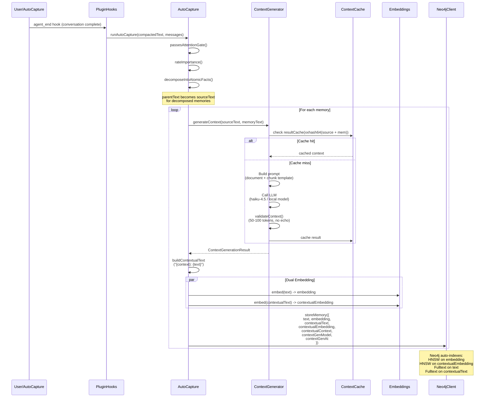
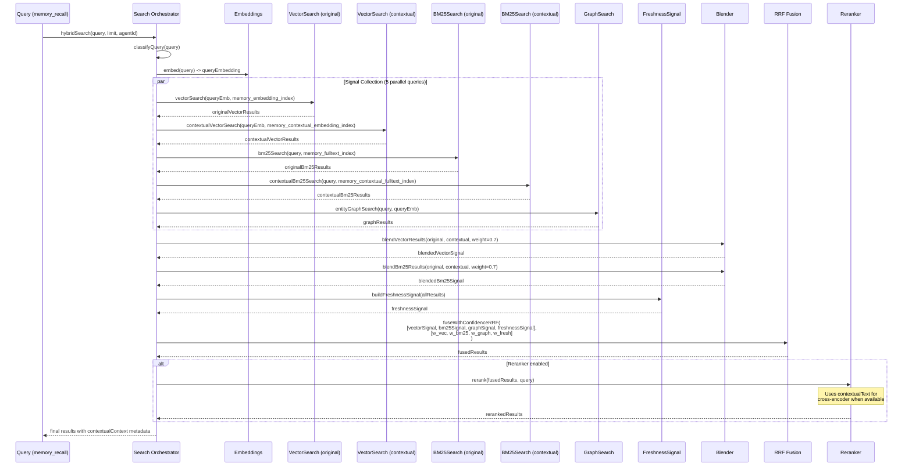
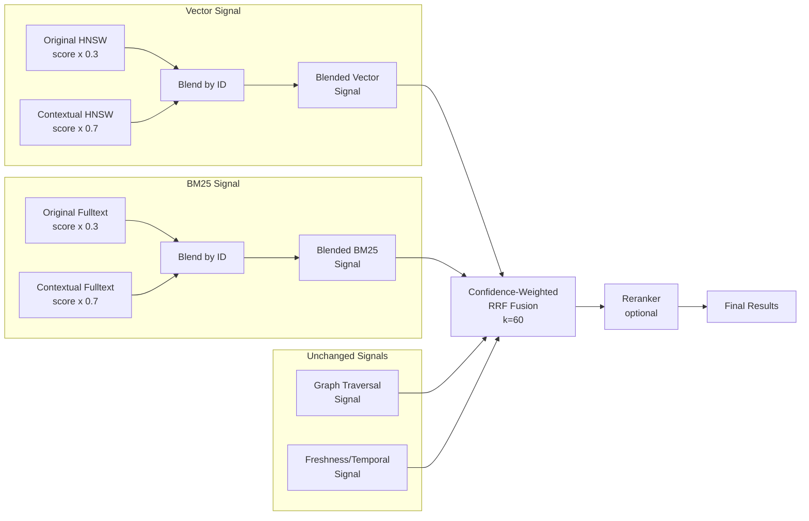
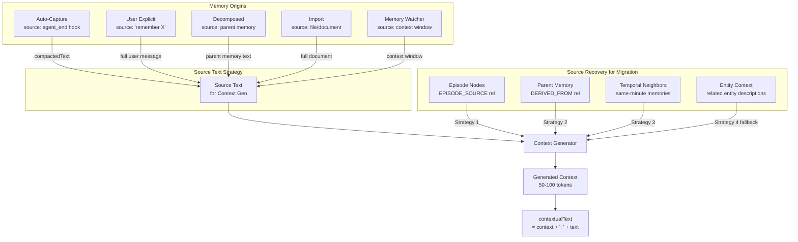
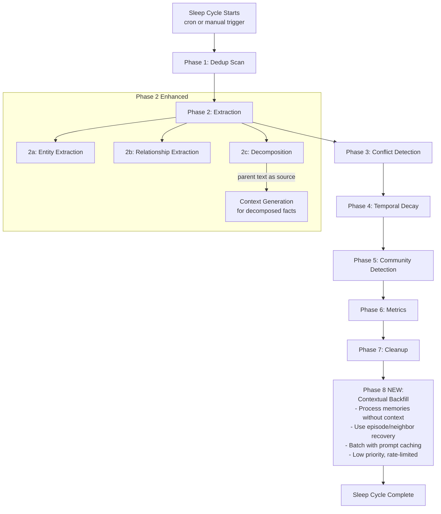
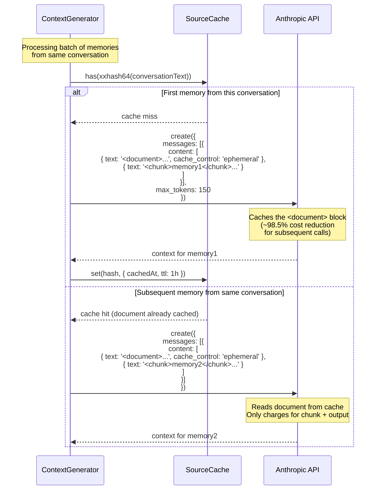

# Data Flow Diagrams

## 1. Context Generation Pipeline (Write Path)



## 2. Hybrid Retrieval Pipeline (Read Path)



## 3. Sub-Signal Blending Detail



## 4. Memory Sources and Context Recovery



## 5. Sleep Cycle Integration



## 6. Prompt Caching Flow (Anthropic API)



## 7. Migration Pipeline

```mermaid
flowchart TD
    START[openclaw memory migrate-contextual]

    START --> PHASE[Select Phase]

    PHASE -->|--phase indexes| IX[Create Contextual Indexes<br/>HNSW + Fulltext]
    IX --> IX_VERIFY[Verify indexes ONLINE]

    PHASE -->|--phase migrate| QUERY[Query memories<br/>WHERE contextualEmbedding IS NULL<br/>ORDER BY importance DESC]

    QUERY --> BATCH[Fetch batch of N memories]

    BATCH --> FIND[Find source text<br/>1. Episode nodes<br/>2. Parent memory<br/>3. Temporal neighbors<br/>4. Entity context]

    FIND -->|source found| GEN[Generate context via LLM]
    FIND -->|no source| SKIP[Skip, increment skipped counter]

    GEN --> EMBED[Embed contextualText]
    EMBED --> UPDATE[updateMemoryContext()]
    UPDATE --> NEXT{More batches?}

    SKIP --> NEXT

    NEXT -->|yes| BATCH
    NEXT -->|no| STATS[Report: processed, succeeded,<br/>failed, skipped, cost]

    PHASE -->|--phase validate| VAL[Validate Migration]
    VAL --> VAL_CHECK[Check:<br/>- contextual field consistency<br/>- embedding dimensions<br/>- index queryability<br/>- coverage percentage]
    VAL_CHECK --> VAL_REPORT[Report: healthy / needs-attention]
```
